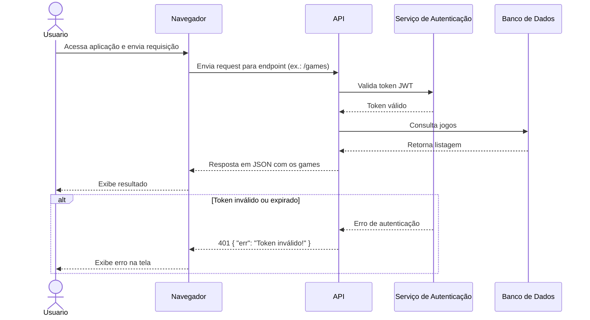

# API de Games
Esta API é utilizada para ...
## Endpoints

### Diagrama Geral
Para facilitar a visualização do fluxo da API, o diagrama abaixo mostra a interação principal entre o usuário, a camada de autenticação e o serviço de jogos.



###  GET /games
Esse endpoint é responsável por retornar a listagem de todos os games cadastradi no banco de dados.
#### Parâmetros 
Nenhum
#### Respostas
##### OK! 200
Caso essa resposta aconteça você vai receber a listagem de todos os games.
Exemplo de resposta:
````
[
    {
        "id": 23,
        "title": "Call of duty MW",
        "year": 2019,
        "price": 60
    },
    {
        "id": 65,
        "title": "Sea of thieves",
        "year": 2018,
        "price": 40
    },
    {
        "id": 2,
        "title": "Minecraft",
        "year": 2012,
        "price": 20
    }
]
````
##### Falha na autenticação! 401
Caso essa resposta aconteça, isso sigfnifica que houve alguma falha durante o processo de autenticaão da requisição. Motivos: Token inválido, Token expirado.

Exemplo de resposta:

```
{
    "err": "Token inválido!"
}
```

###  POST/auth
Esse endpoint é responsável por fazer o processo de login.
#### Parâmetros 

email: E-mail do usuário cadastrado no sistema.

passoword: Senha do usuário cadastrado no sistema, com aquele determinado e-mail.

Exemplo: 

```
{
    "email": "eduardolneto@gmail.com",
    "password": "nodejs<3"
}

```
#### Respostas
##### OK! 200
Caso essa resposta aconteça você vai receber a listagem de todos os games.
Exemplo de resposta:
````
[
    {
        "id": 23,
        "title": "Call of duty MW",
        "year": 2019,
        "price": 60
    },
    {
        "id": 65,
        "title": "Sea of thieves",
        "year": 2018,
        "price": 40
    },
    {
        "id": 2,
        "title": "Minecraft",
        "year": 2012,
        "price": 20
    }
]
````
##### Falha na autenticação! 401
Caso essa resposta aconteça, isso sigfnifica que houve alguma falha durante o processo de autenticaão da requisição. Motivos: Senha ou e-mail incorretos.

Exemplo de resposta:

```
{
    "err": "Credenciais inválidas!"
}
```
